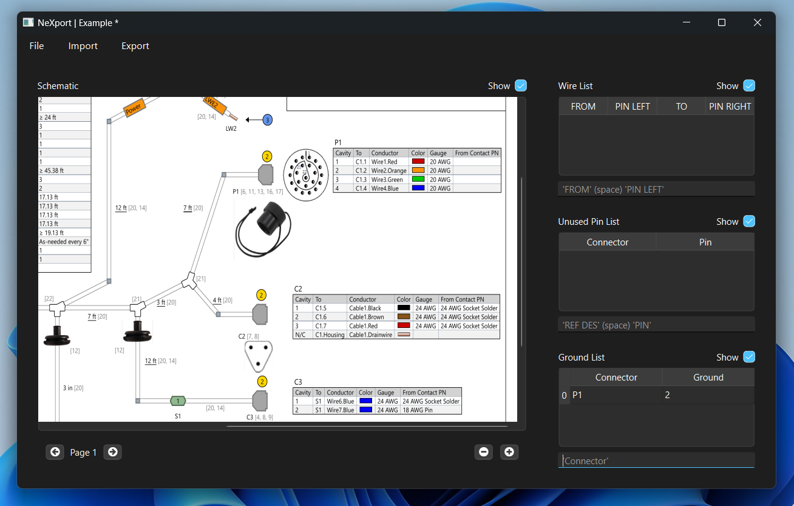

<!-- Improved compatibility of back to top link: See: https://github.com/othneildrew/Best-README-Template/pull/73 -->
<a id="readme-top"></a>
<!--
*** Thanks for checking out the Best-README-Template. If you have a suggestion
*** that would make this better, please fork the repo and create a pull request
*** or simply open an issue with the tag "enhancement".
*** Don't forget to give the project a star!
*** Thanks again! Now go create something AMAZING! :D
-->


<!-- PROJECT LOGO -->
<br />
<div align="center">
  <a href="https://github.com/MichaelCampos-eng/wiregui">
    
  </a>

<h3 align="center">NeXport</h3>

  <p align="center">
    GUI wire manager that maps connections and connectors for DITMCO testing.  
    <br />
    <a href="https://github.com/MichaelCampos-eng/wiregui.git"><strong>Explore the docs »</strong></a>
    <br />
    <br />
    <a href="https://github.com/MichaelCampos-eng/wiregui.git">View Demo</a>
    &middot;
    <a href="https://github.com/MichaelCampos-eng/wiregui.git/issues/new?labels=bug&template=bug-report---.md">Report Bug</a>
    &middot;
    <a href="https://github.com/MichaelCampos-eng/wiregui.git/issues/new?labels=enhancement&template=feature-request---.md">Request Feature</a>
  </p>
</div>


<!-- TABLE OF CONTENTS -->
<details>
  <summary>Table of Contents</summary>
  <ol>
    <li>
      <a href="#about-the-project">About The Project</a>
      <ul>
        <li><a href="#built-with">Built With</a></li>
      </ul>
    </li>
    <li>
      <a href="#getting-started">Getting Started</a>
      <ul>
        <li><a href="#prerequisites">Prerequisites</a></li>
        <li><a href="#installation">Installation</a></li>
      </ul>
    </li>
    <li><a href="#usage">Usage</a></li>
    <li><a href="#roadmap">Roadmap</a></li>
    <li><a href="#contributing">Contributing</a></li>
    <li><a href="#license">License</a></li>
    <li><a href="#contact">Contact</a></li>
  </ol>
</details>


<!-- ABOUT THE PROJECT -->
## About The Project

<div align="center">
  <a href="https://github.com/MichaelCampos-eng/wiregui">
    
  </a>
</div>

Although DITMCO NETS program can produce test scripts with various parameters given a wire list, the goal of this
project is to help the operator with creating several types of lists and/or producing list specific test scripts.
The program is a quick tool that allows the operator to view the schematic and insert mappings for each list simultaneously, handling duplicate mappings and displaying easy to read tables. 

<p align="right">(<a href="#readme-top">back to top</a>)</p>


### Built With

[![PyQt6]][PyQt6-url]

<p align="right">(<a href="#readme-top">back to top</a>)</p>


<!-- GETTING STARTED -->
## Getting Started

The package requires several main stream packages as well as a custom library. A YAML file for conda environment
creation and a TOML file for dependencies installation are used to configure the GUI.

### Prerequisites

Install git for Windows [https://git-scm.com/downloads/win]

* Git installation using Powershell
  ```sh
  winget install --id Git.Git -e --source winget
  ```

Install miniconda for Windows [https://docs.anaconda.com/miniconda/install/]
* Miniconda installation using Powershell
  ```sh
  curl https://repo.anaconda.com/miniconda/Miniconda3-latest-Windows-x86_64.exe -o .\miniconda.exe
  start /wait "" .\miniconda.exe /S
  del .\miniconda.exe
  ```

### Installation

1. Clone the repo
   ```sh
   git clone https://github.com/MichaelCampos-eng/wiregui
   ```
3. Create a new environment with package prerequisites at root project
   ```sh
   conda env create -f environment.yaml
   ```
4. Download dependencies at root project
   ```sh
   pip install .
   ```

<p align="right">(<a href="#readme-top">back to top</a>)</p>


<!-- USAGE EXAMPLES -->
## Usage

To run the gui, open the anaconda terminal prompt and run `start.py`

  ```sh
  python start.py
  ```

For each table shown, the user input text boxes show the format the user need to follow.

  1. Wire List: 
    a. 'FROM' (SPACE) 'PIN' correlates to typing in reference designator followed by space followed by pin, press enter when complete
    b. 'TO' (SPACE) 'PIN' correlates to typing in reference designator followed by space followed by pin, press enter when complete
  
  2. Unused List: 'REF DES' (SPACE) 'PIN' correlates to typing in reference designator for an unused pin followed by space followed by pin, press enter when complete

  3. Ground List:
    a. "Connector" correlates to typing in the harness/adapter reference designator, press enter when complete
    b. "Ground" correlates to typing in associated ground reference designator to be attached to 'Connector', press enter when complete

To remove an entry from list, type REMOVE 'INDEX_NUMBER'

There a 3 tab menus: File, Import, Export

1. File
    * Open
      - 'Open Project' feature that opens file (.tb) containing all list and image schematic data
      - 'Open Document' feature that opens schematic (.pdf)
      - 'Open image' idle feature that opens schematic (.png)
    * 'Save As' creates a project file (.tb) containing schematic and data contents
    * 'Save' saves progress into current project file (.tb)
2. Import
    * Spreadsheet
      - 'Wire List' opens csv file with appropriate column names: ["FROM", "PIN", "TO", "PIN"] and displays it on table
      - 'Unused List' opens csv file with appropriate column names: ["CONNECTOR", "PIN"] and displays it on table
      - 'Ground list' opens csv file with appropriate column names: ["CONNECTOR", "GROUND"] and displays it on table
3. Export
    * Spreadsheet
      - 'Wire List' saves wire list as csv file with column names: ["FROM", "PIN", "TO", "PIN"]
      - 'Unused List' saves unused pins list as csv file with column names: ["CONNECTOR", "PIN"]
      - 'Ground list' saves ground list as csv file with column names: ["CONNECTOR", "GROUND"]
      - 'All' saves all lists as csvs in a directory
    * Test
      - 'Wire List' creates test script for list
      - 'Unused List' creates test script for list
      - 'Ground list' creates test script for list
      - 'All' creates a single test script for all lists

<p align="right">(<a href="#readme-top">back to top</a>)</p>

<!-- ROADMAP -->
## Roadmap

- [X] Data transfer
    - [X] Export/Import spreadsheets
    - [X] Export custom DITMCO test scripts
- [ ] List Management
    - [X] Append/Remove to entries
    - [X] Duplicate handling
    - [ ] In-place entry manipulation
- [ ] Wire Detection
    - [X] Import and convert pdf schematic to image
    - [ ] Detect wire connections 
    - [ ] Appends connector-pin to wire list upon clicking on wire
- [ ] Automated Net List Creation
    - [ ] Implementation of object detection to identify all components and location
    - [ ] With wire detection, automatically map all connector-pins 

See the [open issues](https://github.com/MichaelCampos-eng/wiregui.git/issues) for a full list of proposed features (and known issues).

<p align="right">(<a href="#readme-top">back to top</a>)</p>


<!-- CONTRIBUTING -->
## Contributing

Contributions are what make the open source community such an amazing place to learn, inspire, and create. Any contributions you make are **greatly appreciated**.

If you have a suggestion that would make this better, please fork the repo and create a pull request. You can also simply open an issue with the tag "enhancement".
Don't forget to give the project a star! Thanks again!

1. Fork the Project
2. Create your Feature Branch (`git checkout -b feature/WireGui`)
3. Commit your Changes (`git commit -m 'Add some WireGui'`)
4. Push to the Branch (`git push origin feature/WireGui`)
5. Open a Pull Request

<p align="right">(<a href="#readme-top">back to top</a>)</p>


<!-- LICENSE -->
## License

Distributed under the project_license. See `LICENSE.txt` for more information.

<p align="right">(<a href="#readme-top">back to top</a>)</p>


<!-- CONTACT -->
## Contact

Michael Campos - michael_C55@berkeley.edu

Project Link: [https://github.com/MichaelCampos-eng/wiregui.git](https://github.com/MichaelCampos-eng/wiregui.git)

<p align="right">(<a href="#readme-top">back to top</a>)</p>


<!-- MARKDOWN LINKS & IMAGES -->
<!-- https://www.markdownguide.org/basic-syntax/#reference-style-links -->
[contributors-shield]: https://img.shields.io/github/contributors/othneildrew/Best-README-Template.svg?style=for-the-badge
[contributors-url]: https://github.com/othneildrew/Best-README-Template/graphs/contributors
[forks-shield]: https://img.shields.io/github/forks/othneildrew/Best-README-Template.svg?style=for-the-badge
[forks-url]: https://github.com/othneildrew/Best-README-Template/network/members
[stars-shield]: https://img.shields.io/github/stars/othneildrew/Best-README-Template.svg?style=for-the-badge
[stars-url]: https://github.com/othneildrew/Best-README-Template/stargazers
[issues-shield]: https://img.shields.io/github/issues/othneildrew/Best-README-Template.svg?style=for-the-badge
[issues-url]: https://github.com/othneildrew/Best-README-Template/issues
[license-shield]: https://img.shields.io/github/license/othneildrew/Best-README-Template.svg?style=for-the-badge
[license-url]: https://github.com/othneildrew/Best-README-Template/blob/master/LICENSE.txt
[linkedin-shield]: https://img.shields.io/badge/-LinkedIn-black.svg?style=for-the-badge&logo=linkedin&colorB=555
[linkedin-url]: https://linkedin.com/in/othneildrew
[product-screenshot]: images/screenshot.png
[Next.js]: https://img.shields.io/badge/next.js-000000?style=for-the-badge&logo=nextdotjs&logoColor=white
[Next-url]: https://nextjs.org/
[React.js]: https://img.shields.io/badge/React-20232A?style=for-the-badge&logo=react&logoColor=61DAFB
[React-url]: https://reactjs.org/
[Vue.js]: https://img.shields.io/badge/Vue.js-35495E?style=for-the-badge&logo=vuedotjs&logoColor=4FC08D
[Vue-url]: https://vuejs.org/
[Angular.io]: https://img.shields.io/badge/Angular-DD0031?style=for-the-badge&logo=angular&logoColor=white
[Angular-url]: https://angular.io/
[Svelte.dev]: https://img.shields.io/badge/Svelte-4A4A55?style=for-the-badge&logo=svelte&logoColor=FF3E00
[Svelte-url]: https://svelte.dev/
[Laravel.com]: https://img.shields.io/badge/Laravel-FF2D20?style=for-the-badge&logo=laravel&logoColor=white
[Laravel-url]: https://laravel.com
[Bootstrap.com]: https://img.shields.io/badge/Bootstrap-563D7C?style=for-the-badge&logo=bootstrap&logoColor=white
[Bootstrap-url]: https://getbootstrap.com
[JQuery.com]: https://img.shields.io/badge/jQuery-0769AD?style=for-the-badge&logo=jquery&logoColor=white
[JQuery-url]: https://jquery.com 

[PyQt6]: https://img.shields.io/badge/PyQt6-6.8.1-blue
[PyQt6-url]: https://doc.qt.io/qtforpython-6/

